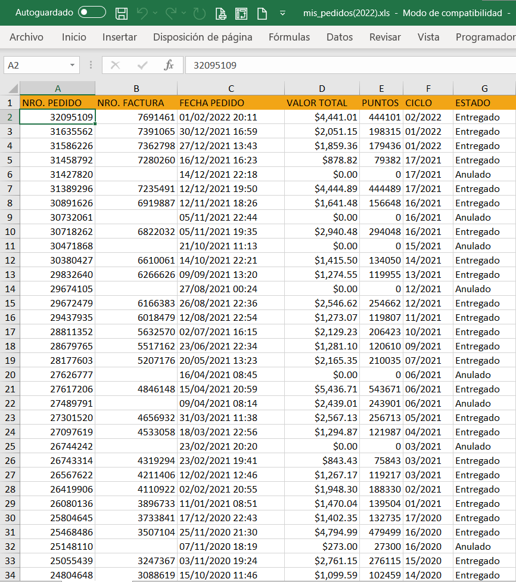

# Historical Purchasing Report on Natura's Ordering Data (2019-2023)

## Table of Contents
- [Introduction](#0)  
- [Data](#1)  
  - [Raw Data](#2)  
- [Reports](#3)  
  - [2022 Report (Microsoft Excel)](#4) 
    - [Link to report](#6) 
  - [2023 Report (Microsoft Power BI)](#5) 
    - [Link to report](#7) 
 
 
## Introduction 

A year ago when I was starting my career in the programming world -at this point I had not yet chosen that I wanted to become a data specialist- and I was looking for a job I decided that I should relearn certain tools and thus be updated to be able to employ me more easily. In this case the program I chose was Microsoft Excel, because its use is very widespread and I had already had an approach to it, so I spent a few weeks learning more functions and understanding it in depth. 

Looking for a way to put my newly acquired knowledge into practice, my girlfriend came up with an excellent idea, that I should analyze her order history that she had made in [Natura](https://www.natura.com.mx/) during the previous years. But what is Natura? Natura is a Brazilian multinational company that manufactures and markets beauty and hygiene products through direct sales by independent consultants, of which my girlfriend is one. 

In her personal page she can download an Excel sheet that gives her data about her orders, but I didn't have a clear idea of what I could do with them, because the document was in a somewhat old format and data cleaning is not something I mastered, so I wondered if I could do something with them or what could be done. 

On that date which was February 2022 I made a Dashboard in Excel, and recently with updated data I made the same report but with Power BI.
So in this presentation I will show what I did for her, with the permission to share it.

## Data 

The data was extracted from my girlfriend's personal Natura account, which she gave me permission to review and publish.

Each of the records represents a general order which contains the following fields:
- **Order number:** Can be understood as the order id.
- **Invoice number**
- **Order date:** Date the order was placed, not the delivery date which is about 5 days. 
- **Total purchase value:** Total sum of product costs, shipping, taxes and others.
- **Points obtained:** The natural points are an indicator of the level in the company.
- **Cycle:** Each cycle has a different magazine, in which different products and offers are offered. It lasts 21 days and there are 17 per year.
- **Status:** This field indicates whether the order has been placed or not.

#### Raw Data  

- [Link to 2022 data](https://correobuap-my.sharepoint.com/:x:/g/personal/arturo_diazga_alumno_buap_mx/EUgOBeR3LuFNgWjDfPDCYjkB9lcOiwnqM6bBQzsTODIXwA?e=82di8E)  (Date obtained: February 9, 2022) 
- [Link to 2023 data](https://correobuap-my.sharepoint.com/:x:/g/personal/arturo_diazga_alumno_buap_mx/ESKp0cKSlF1CqOy_DvmgcxQB1vAXqRZ_uHOqltMU-nNbZQ?e=q0TACE)  (Date obtained: February 14, 2023) 

 
 

## Reports 
### 2022 Report (Microsoft Excel) 

This first report was completed on February 17, 2022 and was prepared in Microsoft Excel.

With Excel you can do many things, among them is to make Dashboards. The process used was simple:
- **Choose indicators:** I chose to use only the date, total purchase value, cycle and status fields.
- **Data cleansing:** ** Date: The date format has 
  - Date: The date format has some errors, as it appears as text, so I just had to format it as date.
  - Status: I excluded cancelled orders by using filters.

- **Analysis:** I proceeded to make a table format for pivot tables along with the following pivot charts:
  - Total purchases per year - _Bar chart_
  - Evolution of purchases - _Line chart_
  - Top 5 by cycle - _Column chart_ 
  - Top 5 by date - _Column chart_
  - Average - _Pie chart_ 
  
   [**Table Link**](https://correobuap-my.sharepoint.com/:x:/g/personal/arturo_diazga_alumno_buap_mx/ETvuTTx2VzVFk64NTDnt0_YBUq0n_L_2sDfPf_Plofh6OQ?e=cYrlD8)
   
 

 
 
 
 
 

- **Report:**. 
Finally I joined everything in reference format, added structure and formatting, and finally I added two segmenters:
- Date
- Cycle  
and attached them to all the graphs so that they would update.

#### [Link to Microsoft Excel Report](https://innovaccion-my.sharepoint.com/:x:/g/personal/ceinnova12182_innovaccion_mx/Ef_47hvqLNlDptM4EysFTngBdsnxIeQTLACnLGhZYEBN7w?e=MY2qlL) 

### 2023 Report (Microsoft Power BI) 

This report happened to be completed on February 12, 2023 and was created with Power BI.  

Although this report is derived from the previous one, the creation was much faster and by far. Although it is a tool that I have interacted with a little less, its interface is easy to use and learn. And the finish is more aesthetic and cleaner. It allowed me to visualize quickly and there were not many complications, it is almost all automatic. If I could list the steps these would be very few, but I show them in comparison with the previous report:

- **Data cleanup:** This task was done automatically by power BI, I just loaded the data from the file and it was already formatted, my only tasks consisted of filtering the Order Status, and grouping the cycles for better segmentation -something I could have done in Excel-.

- **Analysis:** I added the same graphics and a card with the number of orders placed, as this number is very important to have a clearer idea when using the segmenters.

- **Report:** 
In terms of segmenters I now added three different ones:
  - Year
  - Month
  - Cycle: This last one was improved with respect to the previous one for a better visualization and control.
 Actually all of them had a substantial improvement, as this allows a better control of the report, and it is more intuitive and cleaner.

 
 

#### [Link To Power BI Report](https://www.novypro.com/project/natura-report-dmanpg) (This link is to novypro, a site for storing reports in Power BI.)  

## Comments

Not only can you notice that Power BI is a better tool to make this kind of visualizations, but the time spent is much less. What took me several hours with Microsoft Excel, I was able to reduce to a few hours with Power BI.

I also note that although it does not seem a very complex or far-reaching project, for me it will be one of the most valuable, and not only because I did it for my girlfriend -although I think it is a good reason- but the important thing is that it was and is functional for her. She was able to visualize trends, ups and downs, and also patterns in her orders. As I see it and as I have learned, even visualized data must have an objective, it is not just to show for the sake of showing, it must inform, be functional for the target audience, have an impact for decision making and I think I managed to materialize it in this first project.

